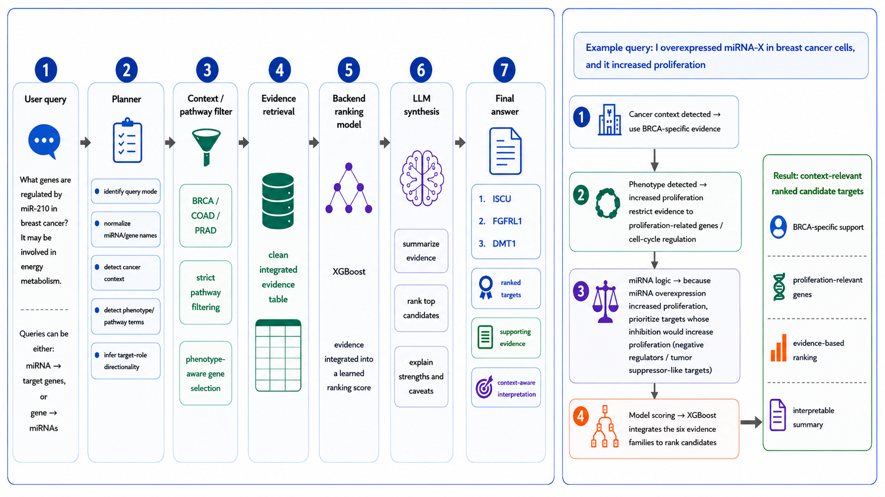

### Evidence-grounded, context-aware miRNA–target prioritization

**Version 1.0**

[Launch the hosted app](https://andy-ring-mirassist.share.connect.posit.cloud/) ·
[Download the Claude skill](https://github.com/Andy-Ring/miRAssist/releases/latest)

---

## What miRAssist does

miRAssist ranks candidate microRNA–target interactions and explains the evidence behind
each result. It supports both common query directions:

- **miRNA → targets:** “Which genes does miR-21 target in breast cancer?”
- **gene → miRNAs:** “Which miRNAs regulate PTEN?”

The production evidence universe contains 280,917 transcript-level candidates, including
2,583 interactions aligned to the retained miRTarBase known-positive set. A validated
random-forest model ranks the candidates using integrated sequence, structure, binding,
and expression evidence. Its held-out performance was AUROC 0.846238 and PR-AUC 0.134752.

The language layer never generates scientific measurements. Scores, percentiles,
candidate ranks, pathway memberships, and cancer-context evidence are computed by the
backend and supplied to the synthesizer as constrained evidence cards.

## How it works

1. **Plan** — direct entity lookups use a deterministic parser; complex questions use an
   LLM to produce a structured `QuerySpec`. Backend normalization then resolves direction,
   miRNA arm handling, supported cancer contexts, phenotype direction, filters, and result
   limits.
2. **Retrieve and rank** — the backend queries the frozen production evidence snapshot,
   applies the requested evidence and novelty filters, and preserves the validated
   random-forest ranking.
3. **Apply biological context** — pathway requests are resolved against GO Biological
   Process, Reactome, WikiPathways, and Hallmark gene sets. BRCA, COAD, and PRAD queries
   can use cohort-specific TCGA repression evidence.
4. **Synthesize** — the LLM receives only the ranked evidence cards. It must preserve
   candidate order, attribute evidence to the correct candidate, treat the miRAssist score
   as relative prioritization rather than biological probability, and avoid unsupported
   pathway, mechanism, or validation claims.

The Streamlit app uses OpenAI models for planning and synthesis. The Claude skill exposes
the same deterministic retrieval contract as a local CLI, with Claude performing the
planning and synthesis steps.

## Evidence families

| Evidence family | Source | What it captures |
|---|---|---|
| Sequence complementarity | miRNA and mRNA 3′ UTR sequences | canonical seed matches |
| Sequence conservation | TargetScan | conserved target-site context |
| Thermodynamic stability | RNAhybrid | miRNA–mRNA duplex free energy |
| Target-site accessibility | RNAplfold | local unpaired probability |
| Functional binding | CLIP-seq / ENCORI | measured binding support |
| Functional repression | TCGA | expression anticorrelation in BRCA, COAD, and PRAD |

miRTarBase known positives are used as evaluation labels and are not model input
features. Feature percentiles are computed against the complete production evidence
universe.

## Use the web app

The hosted app is available at:

https://andy-ring-mirassist.share.connect.posit.cloud/

To run it locally:

~~~bash
git clone https://github.com/Andy-Ring/miRAssist.git
cd miRAssist
python -m venv .venv
source .venv/bin/activate
pip install -r requirements.txt
cp .env.example .env
~~~

Set an OpenAI API key in `.env`:

~~~dotenv
MIRASSIST_LLM_BACKEND=openai
OPENAI_API_KEY=sk-...
MIRASSIST_PLANNER_MODEL=gpt-5.4-nano
MIRASSIST_SYNTH_MODEL=gpt-5.4-mini

EVIDENCE_BACKEND=github
JOBSTORE_BACKEND=filesystem
~~~

The planner and synthesizer defaults are current OpenAI API model aliases:
[GPT-5.4 nano](https://developers.openai.com/api/docs/models/gpt-5.4-nano) and
[GPT-5.4 Mini](https://developers.openai.com/api/docs/models/gpt-5.4-mini).

Start the app:

~~~bash
streamlit run app.py
~~~

The evidence snapshot is downloaded from the latest GitHub release and cached locally.
No database is required.

## Use the Claude skill

The Claude skill needs no OpenAI key. On first use it downloads the production evidence
snapshot from the latest GitHub release and caches it locally.

1. Download `mirassist_skill.zip` from the
   [latest release](https://github.com/Andy-Ring/miRAssist/releases/latest).
2. In Claude, enable code execution.
3. Add the zip as a custom skill.
4. Start a new chat and ask a miRNA–target question in natural language.

The skill can also be run directly:

~~~bash
python mirassist-skill/scripts/retrieve.py \
  --mirna "hsa-miR-21-5p" \
  --tcga BRCA \
  --phenotype apoptosis \
  --observed-change promoted \
  --perturbation overexpression \
  --result-count 5 \
  --pretty
~~~

See [INSTALL_SKILL.md](INSTALL_SKILL.md) for installation details and
[mirassist-skill/SKILL.md](mirassist-skill/SKILL.md) for the query grammar and grounding
rules.

## Configuration

| Variable | Purpose | Default |
|---|---|---|
| `EVIDENCE_BACKEND` | Evidence source | `github` |
| `MIRASSIST_EVIDENCE` | Explicit local evidence file | unset |
| `EVIDENCE_TABLE` | Hosted production table | versioned production table |
| `JOBSTORE_BACKEND` | App job persistence | `filesystem` |
| `MIRASSIST_USE_LEARNED_SCORE` | Use the persisted production score | `1` |
| `MIRASSIST_LEARNED_SCORE_COLUMN` | Persisted score field | `mirassist_model_score` |
| `MIRASSIST_DEFAULT_RESULT_COUNT` | Results shown | `5` |
| `OPENAI_API_KEY` | OpenAI key for the web app | unset |
| `MIRASSIST_PLANNER_MODEL` | Planner model | `gpt-5.4-nano` |
| `MIRASSIST_SYNTH_MODEL` | Synthesis model | `gpt-5.4-mini` |

## Repository layout

~~~text
miRAssist/
├── app.py                 # Streamlit entry point
├── backend/               # planner, retrieval, ranking, and synthesis
├── frontend/              # Streamlit interface and assets
├── data/processed/        # compact pathway lookup data
├── mirassist-skill/       # Claude skill source
├── tests/                 # production regression tests
├── requirements.txt
└── .env.example
~~~

Large evidence tables, model artifacts, generated outputs, local research pipelines, and
credentials are intentionally excluded from the repository. The production evidence
snapshot is distributed through GitHub Releases.

## Scientific scope

The miRAssist score is an uncalibrated random-forest vote fraction used only for relative
prioritization within the evidence-supported candidate universe. It is not the probability
that an interaction is biologically true.

Evaluation is positive-unlabeled: miRTarBase supplies known positives, not confirmed
negatives. Results are conditioned on available sequence, conservation, binding, and
expression evidence. MANE Select can omit isoform-specific interactions; TCGA
anticorrelation is indirect; and CLIP support does not establish direct targeting in every
biological context. Experimental validation remains necessary.

## Citation and license

If you use miRAssist in your research, please cite:

> Ring A, Xi Y. *miRAssist: a context-aware, evidence-integration framework for
> interpretable miRNA-target prioritization.* In preparation.

Released under the [MIT License](LICENSE) © 2026 Andrew Ring.
